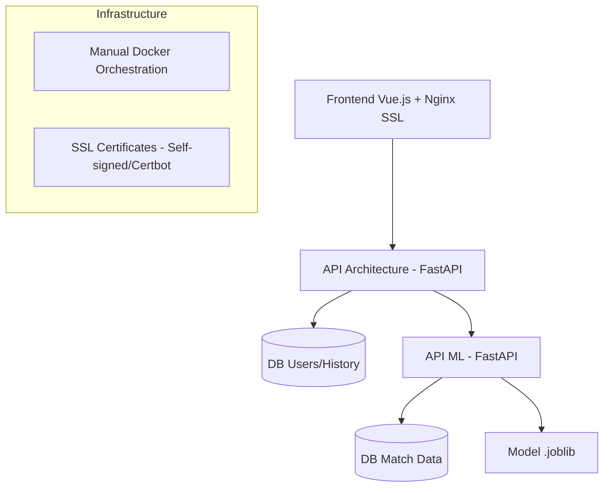

# PLAN D’IMPLEMENTATION - Match Prediction App MVP

Ce document détaille la stratégie technique pour construire l'application de classification de matchs, respectant la séparation stricte des APIs et des bases de données, et le passage vers un environnement de production sécurisé.

## Objectif

Construire une application scalable avec deux APIs FastAPI distinctes (App et ML), deux bases PostgreSQL, et un frontend Vue.js, le tout orchestré par Docker avec une sécurité renforcée.

---

## Architecture Globale

---

## Sprints & Jalons

### [x] SPRINT 0: Structure & Infrastructure

- [x] Initialisation de l'arborescence (app-api, ml-api, frontend).
- [x] Configuration Docker avec orchestration par scripts (`run_docker_env.sh`).
- [x] Setup des environnements (.env).
- [x] Gestion des modules partagés (`shared/`).

### [x] SPRINT 1: API Application (Users & Auth)

- [x] Modèles SQLAlchemy pour `User` et `PredictionHistory`.
- [x] Logique d'authentification JWT (Register/Login).
- [x] Endpoints : `/register`, `/login`, `/me`.

### [x] SPRINT 2: Data Engineering (Ingestion & Stockage)

- [x] Scripts d'ingestion (multi-source : API/Fichiers/Scraping).
- [x] Pipeline de nettoyage et Feature Engineering.
- [x] Stockage des données de matchs dans la DB ML.

### [x] SPRINT 3: Machine Learning (Modèle & Inférence)

- [x] Entraînement (`RandomForest` ou `LogisticRegression`).
- [x] Endpoints ML : `/train`, `/predict`, `/metrics`.
- [x] Sauvegarde/Chargement du modèle via `joblib`.

### [x] SPRINT 4: Intégration & Client

- [x] Client HTTP dans App-API pour communiquer avec ML-API.
- [x] Historisation des prédictions dans DB App.
- [x] Frontend Vue.js 3 (Formulaire + Résultats).
- [x] Sécurisation Frontend avec Nginx et SSL.

### [/] SPRINT 5: Qualité & Documentation (EN COURS)

- [x] Tests unitaires et d'intégration avec `pytest` (API App & ML).
- [ ] Documentation OpenAPI complète (Swagger).
- [x] Guide Docker détaillé (`docker.md`).
- [ ] README final et tutoriel d'installation propre.

### [ ] SPRINT 6: Production Hardening (BACKLOG)

- [ ] **Logging Structuré** : Centralisation des logs (JSON format) pour monitoring.
- [ ] **Sécurité** :
  - [ ] Masquage des headers serveur (Nginx hardening).
  - [ ] Rate Limiting sur les endpoints sensibles (`/login`, `/predict`).
  - [ ] Gestion des secrets via Docker Secrets ou Vault.
- [ ] **Performance** : Cache Redis pour les prédictions fréquentes.
- [ ] **CI/CD** : Pipeline GitHub Actions pour tests auto et build d'images.
- [ ] **Monitoring** : Health checks avancés et intégration Prometheus (optionnel).

---

## Stack Technique

- **Backend** : FastAPI (Python 3.12+)
- **ORM** : SQLAlchemy / Alembic
- **Bases de données** : PostgreSQL (x2 schemas: `footballapp_db`, `footballml_db`)
- **ML** : Scikit-learn, Pandas, Joblib
- **Frontend** : Vue.js 3 + Nginx
- **DevOps** : Docker (Orchestration scripts Bash), OpenSSL

---

## Critères de Validation Production

- [ ] HTTPS activé et fonctionnel sur tous les points d'entrée.
- [ ] Zéro credentials en dur dans le code (100% .env).
- [ ] Taux de couverture de tests > 80%.
- [ ] Logs exploitables en cas d'erreur 500.

---

## Verification Plan

### Automated Tests
- Run all test suites inside Docker containers to ensure environment consistency.
- `docker exec api-app pytest tests/`
- `docker exec api-ml pytest tests_ml/`
- `docker exec api-ml pytest tests_integration/`

### Manual Verification
- Execute `bash scripts/run_docker_env.sh` and verify successful orchestration.
- Check Swagger UI for both services (`/docs`).
- Verify frontend functionality via HTTPS (`https://localhost:8443`).
