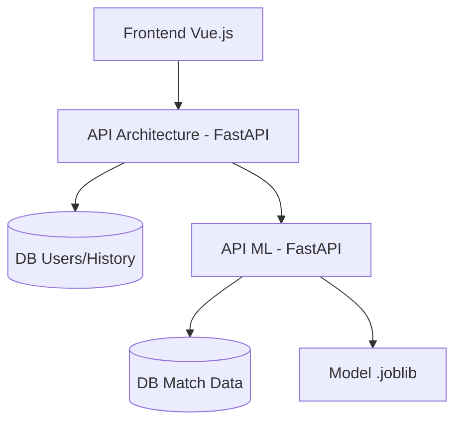

# PLAN D’IMPLEMENTATION - Match Prediction App MVP

Ce document détaille la stratégie technique pour construire l'application de classification de matchs, respectant la séparation stricte des APIs et des bases de données.

## Objectif

Construire une application scalable avec deux APIs FastAPI distinctes (App et ML), deux bases PostgreSQL, et un frontend Vue.js.

---

## Architecture Globale

---

## Sprints & Jalons

### SPRINT 0: Structure & Infrastructure

- Initialisation de l'arborescence (app-api, ml-api, frontend).
- Configuration Docker avec orchestration par scripts (`run_docker_env.sh`).
- Setup des environnements (.env).

### SPRINT 1: API Application (Users & Auth)

- Modèles SQLAlchemy pour `User` et `PredictionHistory`.
- Logique d'authentification JWT (Register/Login).
- Endpoints : `/register`, `/login`, `/me`.

### SPRINT 2: Data Engineering (Ingestion & Stockage)

- Scripts d'ingestion (multi-source : API/Fichiers/Scraping).
- Pipeline de nettoyage et Feature Engineering.
- Stockage des données de matchs dans la DB ML.

### SPRINT 3: Machine Learning (Modèle & Inférence)

- Entraînement (`RandomForest` ou `LogisticRegression`).
- Endpoints ML : `/train`, `/predict`, `/metrics`.
- Sauvegarde/Chargement du modèle via `joblib`.

### SPRINT 4: Intégration & Client

- Client HTTP dans App-API pour communiquer avec ML-API.
- Historisation des prédictions dans DB App.
- Frontend minimal Vue.js (Formulaire de saisie + Affichage résultat).

### SPRINT 5: Qualité & Déploiement

- Tests unitaires et d'intégration avec `pytest`.
- Documentation OpenAPI (Swagger).
- README final et tutoriel d'installation.

---

## Stack Technique

- **Backend** : FastAPI (Python 3.12+)
- **ORM** : SQLAlchemy / Alembic
- **Bases de données** : PostgreSQL (x2)
- **ML** : Scikit-learn, Pandas, Joblib
- **Frontend** : Vue.js 3
- **DevOps** : Docker (Orchestration manuelle via scripts Bash)

---

## Critères de Validation

- Séparation physique des bases de données.
- Authentification sécurisée par JWT.
- Pipeline ML reproductible.
- Tests passants sur les endpoints critiques.
---

## Verification Plan

### Automated Tests
- Run all test suites inside Docker containers to ensure environment consistency.
- `docker exec api-app pytest tests/`
- `docker exec api-ml pytest tests_ml/`
- `docker exec api-ml pytest tests_integration/`

### Manual Verification
- Execute `bash scripts/run_docker_env.sh` and verify successful orchestration.
- Check Swagger UI for both services (`/docs`).
- Verify frontend functionality (Login, Match Predictions).
